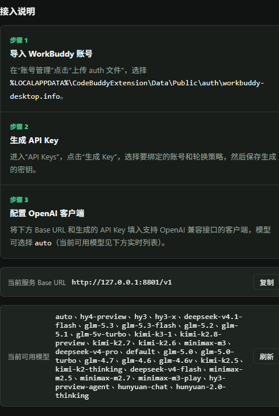

# freeworkbuddy

> 把 **WorkBuddy / CodeBuddy（腾讯代码助手）** 的订阅转换成 **OpenAI 兼容 API**，自带多账号管理面板、API Key 管理、Docker 一键部署。
>
> **来源声明：本项目基于 [HanHan666666/codebuddy2openai](https://github.com/HanHan666666/codebuddy2openai)（MIT）二次开发。原 LICENSE 文件中的版权声明保持不变。**

[English](#english) · [中文文档](#中文文档)



*管理面板预览：账号池、API Key 与官方动态模型列表。*

---

## 中文文档

一个本地代理 / 网关：读取你本机已登录的 WorkBuddy / CodeBuddy 桌面端凭据，把它的对话能力包装成标准的 OpenAI `/v1/chat/completions`、`/v1/models`、`/v1/responses` 接口。**多账号轮换、API Key 管理、Web 管理面板、Docker 部署，开箱即用。**

### ✨ 特性

- 🔄 **OpenAI 兼容**：`/v1/chat/completions`（流式 SSE）、`/v1/models`、`/v1/responses`、`/health`。
- 🛠️ **Function Calling**：原生支持 `tools` / `tool_calls`，可在 ZCode / Cherry Studio 等 agent 客户端里驱动工具、多轮回传。
- 👥 **多账号管理**：拖拽上传 `.info` 凭据文件，自动注册账号；支持 19+ 账号池。
- 🔑 **API Key 管理**：生成 `sk-` 密钥，绑定到指定账号子集；不同 Key 走不同账号池。
- 🔄 **三种轮换策略**：轮流（round-robin）/ 队列（queue）/ 按额度（quota）。
- 🛡️ **429 自动容灾**：某账号被限流时自动切到下一个，最多重试 3 次，60 秒冷却。
- 📊 **额度记账**：从流式 usage chunk 实时聚合每个账号的 token 消耗，按北京日聚合。
- 🤖 **自动签到 + 额度同步**：后台定时同步服务端额度，自动签到。
- 🔐 **管理员认证**：PBKDF2 密码哈希、会话 Cookie、登录限流（8 次 / 5 分钟）。
- 🪶 **模块化结构**：`webbuddy/` 包，清晰的 `auth / stores / rotator / routes / automation` 分层。
- 🐳 **Docker 一键部署**：自带 Dockerfile + docker-compose + Nginx 示例。
- ⚡ **Token 自动刷新**：过期前自动调刷新接口并原子回写。
- 🖥️ **跨平台**：自动定位 macOS / Windows / Linux 上的凭据文件。
- 🚀 **官方模型动态同步**：自动从上游拉取可用模型列表（1h 缓存 + 后台定时刷新），官方上新模型无需改代码。

### 🧠 它是怎么工作的

```
ZCode / Cherry Studio / 任意 OpenAI 客户端
        │  POST /v1/chat/completions  (标准 OpenAI 协议，含 tools + Authorization: sk-xxx)
        ▼
┌─────────────────────────────┐
│  freeworkbuddy (FastAPI)    │  ← 本地网关 (127.0.0.1:8788)
│  ┌─ ApiKey 校验              │
│  ├─ AccountRotator 选号       │
│  ├─ 注入 X-User-Id 等鉴权头  │
│  └─ 透传 + 429 failover      │
└─────────────────────────────┘
        │  POST /v2/chat/completions  (带 Authorization/X-User-Id/X-Enterprise-Id)
        ▼
┌────────────────────────────────┐
│  copilot.tencent.com 后端       │  ← 原生标准 OpenAI 协议
│  (GLM / Kimi / DeepSeek / ...) │     含原生 tools / tool_calls / SSE 流式
└────────────────────────────────┘
```

后端（`copilot.tencent.com`）本身就是标准 OpenAI chat/completions 协议，原生支持 `tools` / `tool_calls`。网关只做三件事：①校验客户端 API Key；②轮换选号并注入账号鉴权头；③在本地 `/v1/*` 与后端 `/v2/*` 之间透传，遇 429 自动换号。

### 📦 前置条件

1. 已安装并**登录** WorkBuddy / CodeBuddy 桌面端。凭据文件位置：
   - **macOS**：`~/Library/Application Support/CodeBuddyExtension/Data/Public/auth/*.info`
   - **Windows**：`%LOCALAPPDATA%\CodeBuddyExtension\Data\Public\auth\*.info`
   - **Linux**：`~/.local/share/CodeBuddyExtension/Data/Public/auth/*.info`
2. **Python 3.8+**
3. 安装依赖：`pip install -r requirements.txt`

### 🚀 快速开始

#### 方式一：直接运行

```bash
git clone https://github.com/ccai40359wq/freeworkbuddy.git
cd freeworkbuddy
pip install -r requirements.txt

# 必须先设置管理员密码（首次启动会用它初始化）
export WEBBUDDY_ADMIN_PASSWORD='一个足够长的随机密码'

python webgui.py --host 127.0.0.1 --port 8788 --data-dir ./data
```

未设置 `WEBBUDDY_ADMIN_PASSWORD` 时，程序会生成一次性随机密码并打印到终端，请尽快登录管理面板修改。

#### 方式二：Docker 部署

```bash
git clone https://github.com/ccai40359wq/freeworkbuddy.git
cd freeworkbuddy
cp docker.env.example .env
# 编辑 .env，设置 WEBBUDDY_ADMIN_PASSWORD
docker compose up -d --build
```

容器监听 `127.0.0.1:8788`，用 Nginx 反代到 443 即可公网访问。详见 `DEPLOY.md`。

### 🔌 接入客户端

在任意 OpenAI 兼容客户端（ZCode / Cherry Studio / Codex / 等）里：

| 配置项 | 值 |
|--------|-----|
| API Base | `http://127.0.0.1:8788/v1`（本机）或 `https://你的域名/v1`（部署后） |
| API Key | 管理面板里生成的 `sk-` 密钥 |
| 模型名 | 在管理面板查看可用模型，或用 `auto` 自动选择 |

### 🧪 curl 验证

```bash
# 列模型
curl http://127.0.0.1:8788/v1/models \
  -H "Authorization: Bearer sk-你的key"

# 非流式
curl http://127.0.0.1:8788/v1/chat/completions \
  -H "Content-Type: application/json" \
  -H "Authorization: Bearer sk-你的key" \
  -d '{"model":"auto","messages":[{"role":"user","content":"你好"}]}'

# 流式
curl -N http://127.0.0.1:8788/v1/chat/completions \
  -H "Content-Type: application/json" \
  -H "Authorization: Bearer sk-你的key" \
  -d '{"model":"auto","stream":true,"messages":[{"role":"user","content":"数1到5"}]}'
```

### 📁 项目结构

```
freeworkbuddy/
├── webgui.py                       # 入口：启动 FastAPI + 扫描凭据 + 启动自动同步
├── converter.py                    # 上游协议转换 + 异常处理
├── desensitize.py                  # 脱敏模块（可选，--desensitize 启用）
├── requirements.txt
├── Dockerfile
├── docker-compose.yml
├── docker.env.example              # 复制为 .env 后修改
├── DEPLOY.md                       # 服务器部署指南
├── LICENSE                         # MIT
├── webbuddy/                       # 核心包
│   ├── __init__.py
│   ├── config.py                   # 运行时配置与数据目录路径
│   ├── auth.py                     # 管理员认证（密码哈希/会话/限流/中间件）
│   ├── stores.py                   # AccountStore / ApiKeyStore / UsageStore
│   ├── rotator.py                  # 账号轮换（round-robin/queue/quota + 429 冷却）
│   ├── automation.py               # 自动签到 + 服务端额度同步 + 模型列表定时刷新
│   ├── models.py                   # 官方模型列表动态获取（TTL 缓存）
│   ├── state.py                    # 全局运行时状态
│   ├── logging_utils.py
│   ├── routes/
│   │   ├── admin.py                # 管理面板 API 路由
│   │   └── openai.py               # OpenAI 兼容端点 + 429 failover + credit 记账
│   └── static/
│       ├── index.html              # 管理面板前端
│       └── login.html              # 登录页
└── tests/
    ├── test_responses_compat.py
    └── test_server.py
```

### 🔧 命令行参数

```
python webgui.py [--host HOST] [--port PORT] [--data-dir DIR] [--log PATH] [--desensitize] [--secure-cookie]
```

| 参数 | 默认 | 说明 |
|------|------|------|
| `--host` | `127.0.0.1` | 监听地址 |
| `--port` | `8788` | 监听端口 |
| `--data-dir` | `./data` | 数据目录（账号、Key、用量、设置） |
| `--log` | 无 | 日志文件路径 |
| `--desensitize` | 关 | 启用脱敏（处理 system/developer 模板中的审核误伤词） |
| `--secure-cookie` | 关 | 仅通过 HTTPS 发送管理会话 Cookie（公网部署建议开启） |

### 🔐 安全注意事项

- **首次启动必须设置 `WEBBUDDY_ADMIN_PASSWORD` 环境变量**，否则会生成一次性密码（请尽快改）。
- 管理面板的密码经 PBKDF2-SHA256（31 万次迭代 + 随机盐）哈希存储，不保存明文。
- 默认只监听 `127.0.0.1`；公网部署务必走 HTTPS + `--secure-cookie`。
- 上传的凭据文件存储在 `data/auths/` 下，**不要提交到 Git**（已在 `.gitignore` 中排除）。

### ❓ 常见问题

- **客户端报 401**：先确认 API Key 正确；若 Key 校验通过但后端 401，可能是账号 token 失效——在桌面端重新登录后重新上传凭据。
- **所有账号 429**：账号池被限流，等 60 秒冷却，或上传更多账号。
- **"敏感内容"被拦截**：通常是后端误伤客户端附带的 system/developer 模板。用 `--desensitize` 处理这些受信任的元数据；用户输入保持原样。

### ⚠️ 免责声明

本项目为个人学习与研究用途，非官方产品，与腾讯 / CodeBuddy / WorkBuddy / OpenAI 无任何关联。使用本工具即表示你已阅读并同意：仅在你拥有合法订阅的前提下使用，遵守相关服务条款，自负风险。

### 📄 开源协议

[MIT](./LICENSE)

---

<a name="english"></a>
# English

A local proxy / gateway that exposes your already-logged-in **WorkBuddy / CodeBuddy (Tencent coding assistant)** subscription as a standard **OpenAI-compatible API** — with a multi-account management panel, API key management, and Docker deployment.

> **Attribution:** This project is a secondary development based on [HanHan666666/codebuddy2openai](https://github.com/HanHan666666/codebuddy2openai), licensed under MIT. The original copyright notice in `LICENSE` is preserved.

### ✨ Features

- 🔄 **OpenAI-compatible**: `/v1/chat/completions` (streaming SSE), `/v1/models`, `/v1/responses`, `/health`.
- 🛠️ **Function Calling**: native `tools` / `tool_calls` support for agent clients.
- 👥 **Multi-account pool**: drag-drop credential upload, 429 failover across accounts.
- 🔑 **API Key management**: generate `sk-` keys bound to account subsets.
- 🔄 **Rotation strategies**: round-robin / queue / by-quota, with 60s cooldown on 429.
- 📊 **Usage tracking**: per-account token consumption aggregated from stream usage chunks.
- 🤖 **Auto check-in + quota sync**: background sync of server-side credits.
- 🔐 **Admin auth**: PBKDF2 password hashing, session cookies, login rate-limiting.
- 🐳 **Docker**: one-command `docker compose up -d --build`.
- 🖥️ **Cross-platform**: auto-locates credentials on macOS / Windows / Linux.
- 🚀 **Dynamic model discovery**: refreshes the official model list with a 1-hour cache and background updates.

### 🚀 Quick Start

```bash
git clone https://github.com/ccai40359wq/freeworkbuddy.git
cd freeworkbuddy
pip install -r requirements.txt

export WEBBUDDY_ADMIN_PASSWORD='a-long-random-password'
python webgui.py --host 127.0.0.1 --port 8788 --data-dir ./data
```

Or with Docker:

```bash
cp docker.env.example .env  # set WEBBUDDY_ADMIN_PASSWORD
docker compose up -d --build
```

Point any OpenAI-compatible client at `http://127.0.0.1:8788/v1` with the `sk-` key from the admin panel. See [DEPLOY.md](./DEPLOY.md) for server deployment.

### ⚠️ Disclaimer

For personal learning and research only. Not affiliated with Tencent / CodeBuddy / WorkBuddy / OpenAI. Use only with a subscription you legally hold, in compliance with the relevant terms of service, at your own risk.

License: [MIT](./LICENSE)
